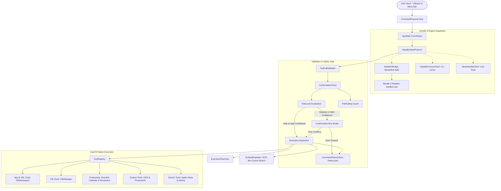

# NeedleBar 🪡

**NeedleBar** is a private, local-first macOS menu-bar automation assistant powered by the [Needle 3](https://github.com/cactus-compute/needle) foundation model.

Open NeedleBar from the menu bar or with a global keyboard shortcut (`⌥Space`), type natural-language instructions, and Needle 3 converts your commands into structured, grammar-constrained tool calls. NeedleBar then validates the parameters, performs multi-tier risk analysis, prompts for confirmation when necessary, and executes safe macOS actions via native Swift APIs, AppKit, EventKit, and AppleScript.

```text
User Command: "Open Xcode and Terminal"
  ↓
Needle 3 (In-Process C Bridge / 2-bit Quantized ~34 MB)
  ↓
Structured Tool Call: [open_application(name: "Xcode"), open_application(name: "Terminal")]
  ↓
Validation (Tool schemas, types, ungrounded parameter checks)
  ↓
Risk Classification (Safe vs. Requires Confirmation)
  ↓
Native macOS Action (NSWorkspace / EventKit / FileManager)
  ↓
Live UI Feedback & Local Vector History Indexing
```

---

## Key Features

- **100% Local & Private**: All inference and embeddings run on-device using the official `needle3.cact` (34 MB) model. No cloud LLMs, no remote API calls, no prompt uploads.
- **Sub-Millisecond In-Process Bridge**: Swift communicates directly with the compiled C runtime (`libneedle3.dylib`) via `dlopen`/`dlsym`, generating tool calls at >2,000 tokens/sec.
- **Grammar-Guaranteed Output**: Uses Needle 3's token-level grammar constraint to eliminate JSON formatting hallucinations.
- **Multi-Tier Safety Model**: Safe read-only and launch actions execute automatically; file moves, renames, app quits, calendar events, and reminders require explicit user confirmation with a full parameter breakdown.
- **Local Semantic Search**: Indexes past commands and files using Needle 3's 3,072-dimensional vector embeddings with cosine similarity matching and deterministic keyword fallback.
- **Native SwiftUI Menu-Bar Experience**: Built with SwiftUI `MenuBarExtra`, keyboard-first shortcuts, dark/light mode support, and accessibility.

---

## Architecture Diagram



---

## Project Structure

```text
NeedleBar/
├── Package.swift                     # Swift 6 Package definition
├── README.md                         # Product documentation
├── scripts/
│   ├── fetch_needle_engine.sh        # Automates downloading needle3.cact & libneedle3.dylib
│   └── build_app.sh                  # Builds and packages standalone NeedleBar.app
├── Sources/
│   ├── NeedleBarCore/                # Business logic, engine bridge, safety, tools
│   │   ├── Models/                   # ToolDefinition, ToolCall, NeedleResponse, ExecutionPlan
│   │   ├── Needle/                   # NeedleClientProtocol, NeedleCBridge, ToolCallValidator
│   │   ├── Safety/                   # RiskLevel, ConfirmationPolicy, PathSafety, PermissionManager
│   │   ├── Storage/                  # CommandHistoryStore, PreferencesStore, EmbeddingIndex
│   │   ├── Tools/                    # ToolProtocol, ToolRegistry, AppTools, FileTools, etc.
│   │   └── App/                      # AppState (Observable central coordinator)
│   └── NeedleBarApp/                 # Menu-bar Application & UI
│       ├── App/                      # NeedleBarApp.swift, GlobalHotkeyMonitor.swift
│       ├── Info.plist                # LSUIElement accessory bundle configuration
│       └── UI/                       # CommandPopoverView, ConfirmationView, SettingsView, etc.
└── Tests/
    └── NeedleBarTests/               # 49 unit and end-to-end integration tests
```

---

## Tool Catalog

NeedleBar includes 17 native automation tools:

| Category | Tool Name | Description | Risk Level |
| :--- | :--- | :--- | :--- |
| **App** | `open_application(name)` | Launch or switch to an application | Safe |
| **App** | `quit_application(name)` | Gracefully terminate a running application | Confirmation |
| **App** | `open_url(url)` | Open a web link in the default browser | Safe |
| **App** | `open_folder(path)` | Reveal a directory in Finder | Safe |
| **Files** | `search_files(query, directory?)` | Search files by name | Safe |
| **Files** | `list_recent_files(directory?, limit?)`| List recently modified files | Safe |
| **Files** | `create_folder(path)` | Create a new folder on disk | Safe |
| **Files** | `move_file(source, destination)` | Move a file to a new location | Confirmation |
| **Files** | `rename_file(path, new_name)` | Rename a file or directory | Confirmation |
| **Productivity** | `start_timer(minutes?, seconds?, label?)` | Start a timer in the macOS Clock app | Safe |
| **Productivity** | `create_reminder(title, due_date?)` | Schedule a task in Apple Reminders | Confirmation |
| **Productivity** | `create_calendar_event(title, start, end?, location?)` | Create an event in Apple Calendar | Confirmation |
| **System** | `get_battery_status()` | Query battery level and charging state | Safe |
| **System** | `get_frontmost_application()` | Identify the active foreground application | Safe |
| **System** | `get_system_summary()` | Retrieve OS version, RAM, and uptime | Safe |
| **Search** | `search_notes(query)` | Search notes inside Apple Notes | Safe |
| **Search** | `search_command_history(query)` | Search previous NeedleBar commands | Safe |

---

## Safety & Security Model

### Risk Tiers
1. **Safe (`.safe`)**:
   - Executes automatically when Needle 3 confidence is $\ge 0.85$.
   - Actions: App opening, URL opening, battery/system queries, file searching, timers.
2. **Requires Confirmation (`.requiresConfirmation`)**:
   - Always halts execution and displays the `ConfirmationView` modal.
   - Shows user command, selected tool, each argument, and affected files/apps.
   - Actions: File moving, file renaming, reminder creation, event creation, quitting apps.
3. **Destructive (`.destructive`)**:
   - Displays a high-contrast danger alert requiring explicit verification.
   - *Note*: File deletion is strictly prohibited in NeedleBar MVP.

### Path Safety Guard (`PathSafety`)
- Enforces strict canonical path resolution, expanding `~` to the user's home directory.
- Blocks directory traversal escapes (`../`).
- Disallows targeting sensitive system folders (`/System`, `/bin`, `/sbin`, `/usr`, `/etc`).
- Verifies that destination files do not already exist to prevent silent overwriting.

---

## Quick Start & Setup

### 1. Prerequisites
- macOS 14.0 (Sonoma) or newer on Apple Silicon (M1/M2/M3/M4)
- Xcode 15+ or Swift 6 toolchain

### 2. Fetch the Needle 3 Engine & Weights
Run the included fetch script to download the official 34 MB `needle3.cact` weights and `libneedle3.dylib` into `~/.cache/cactus-needle/v3/3.0.1/`:
```bash
./scripts/fetch_needle_engine.sh
```

### 3. Run Unit & Integration Tests
Run the 49 unit and end-to-end integration tests:
```bash
swift test --build-path /tmp/needlebar-build
```

### 4. Build and Run NeedleBar.app
To package a standalone `.app` bundle:
```bash
./scripts/build_app.sh
open NeedleBar.app
```

Alternatively, run directly from the command line:
```bash
swift run --build-path /tmp/needlebar-build NeedleBarApp
```

---

## Configuration & Settings

Open the settings panel by clicking the **Settings** tab in the NeedleBar popover:
- **Engine Status**: Live indicator showing whether `libneedle3.dylib` and `needle3.cact` are bound.
- **Test Needle 3**: One-click diagnostic test sending `"What is my battery status?"` through the engine.
- **Model Paths**: Customize the location of `needle3.cact` or `libneedle3.dylib`.
- **Mock Engine Toggle**: Switch to `MockNeedleClient` for offline testing or development without model weights.
- **Global Shortcut**: Customize the global activation shortcut (defaults to `⌥Space`).
- **Privacy & Telemetry**: Telemetry is disabled by default; toggling it off sets `NEEDLE_TELEMETRY=0` and `DO_NOT_TRACK=1`.
- **System Permissions**: Status check and one-click deep links to macOS System Settings for Reminders, Calendar, Files, and Automation.

---

## How to Add a New Tool

To add a new tool to NeedleBar:
1. Create a struct conforming to `ToolProtocol` in `Sources/NeedleBarCore/Tools/`:
   ```swift
   public struct TurnOnDoNotDisturbTool: ToolProtocol {
       public var definition: ToolDefinition {
           ToolDefinition(
               name: "turn_on_dnd",
               description: "Enable macOS Do Not Disturb focus mode.",
               parameters: ParametersSchema()
           )
       }
       public var riskLevel: RiskLevel { .requiresConfirmation }

       public func execute(arguments: [String: AnyCodable]) async throws -> ToolResult {
           // Invoke macOS Focus mode API / Shortcuts
           return .success(tool: definition.name, message: "Turned on Do Not Disturb.")
       }
   }
   ```
2. Register the tool in `ToolRegistry.createDefaultRegistry()`:
   ```swift
   registry.register(tool: TurnOnDoNotDisturbTool())
   ```
3. NeedleBar will automatically serialize the new schema into Needle 3's grammar constraints on launch!

---

## Privacy Model

- **No Remote Network Calls**: NeedleBar has zero network communication during command interpretation and tool execution.
- **No Cloud Inference**: Natural-language intent resolution is powered 100% on-device by Needle 3.
- **Local Storage**: Command history and vector embeddings are stored locally under `~/Library/Application Support/NeedleBar/`.
- **No Telemetry**: No user prompts, tool arguments, or file names are ever collected or transmitted.
